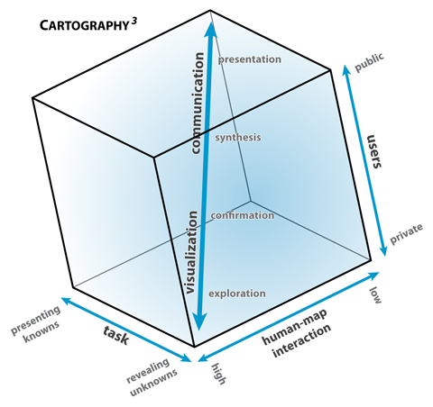
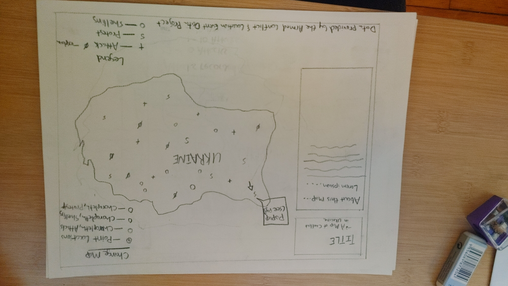
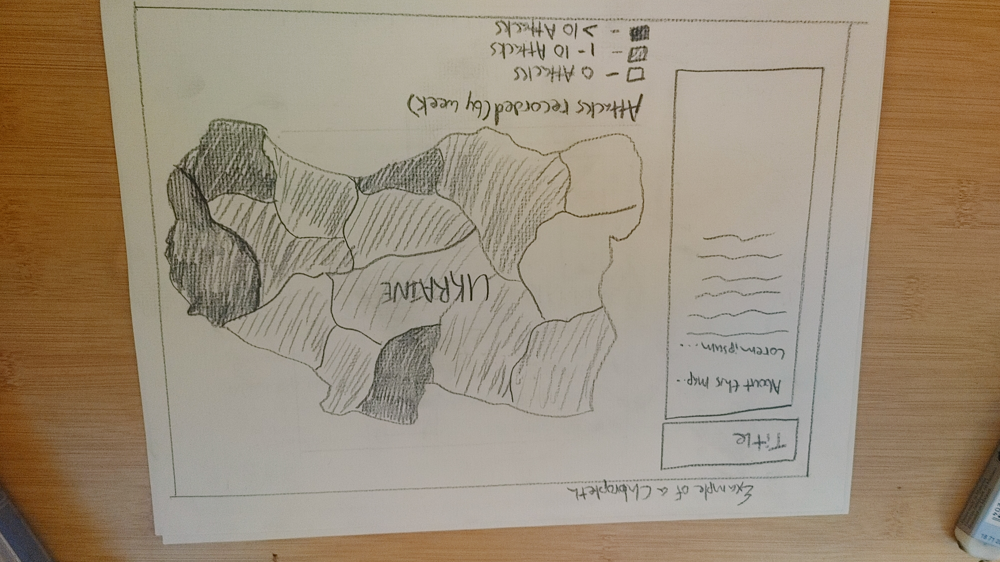
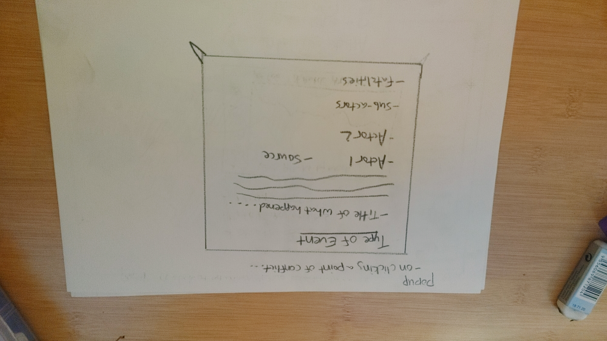

# Conflict-Crisis-Mapping-Project

## 
 <b>Table of Contents </b>

<b>1.</b> Introduction 

<b>2.</b> Methodology 

<b>3.</b> Data Processing & Analysis 

<b>4.</b> Dissemination of Visualizations

<b>5.</b> Evaluation of Effects 

<b>6.</b> Conclusion

<b>7.</b> Citations

# 
 <b>Chapter 1: Introduction 
</b>

This repository hosts the Ukrainian War Information Mapping Project. The current humanitarian crisis in Ukraine has wrought havoc in synthesizing the numbers of chaos currently unfolding throughout the country. Particularly, this project seeks to create a user-interface synthesizing the current humanitarian landscape by metrics related to international aid, displaced persons, and affected health facilities.  Furthermore, it is designed to collect and process data from the Armed Conflict Location and Event Data Project's RESTful API in order to document confrontations currently taking place in Ukraine. This project aims to visualize these datasets, providing a robust interface for use by the public.

 Additionally, the U.N.'s Office for the Coordination of Humanitarian Affairs (OFCHA)'s [Internally Displaced Persons Estimates](https://data.humdata.org/dataset/ukraine-idp-estimates) contain populations of displacement at the second-level administrative division. 
 Other datasets that might be utilized include The United Nations Population Fund's [Ukrainian Subnational Population Statistics from 2020](https://data.humdata.org/dataset/cod-ps-ukr) as well as The  United Nations Office for the Coordination of Humanitarian Affairs' [border crossing locations.](https://data.humdata.org/dataset/ukraine-border-crossings). 

The project aims to utilize a broad portfolio of Web 2.0 tools and frameworks for cartography including a wide variety of data design, visualization, and UI-centered platforms. These tools and frameworks provide effective means for data aggregation, visualization, and public dissemination. Data from the ACLED's RESTful servers will provide updated content throughout a map including a user interface with charts in popups related to the weekly ACLED report. This will be integral towards providing an up-to-date account of what is happening in real time while also displaying contextualization through user input and data visualizations. 

Roth

 This project seeks to fill a corner in the cartography cube by <a href= "https://www.researchgate.net/publication/271078641_Interactive_Maps_What_we_know_and_what_we_need_to_know"> Roth from MacEachren (1994)</a> by being a fairly interactive, public-facing map that synthesizes and presents <i>knowns</i> as opposed to revealing more <i>unknowns.</i> In other words, the UI will not provide an <i>extreme</i> level of interactivity because it is not concerned with the task of revealing <i>unknowns,</i> but rather, presenting what is <i>known.</i> Therefore, the project seeks to constrain user interactivity to a limited degree. This ensures synthesis of the known data can be openly peer-reviewed reproducible in a like-minded project.

The users in mind for this project should be considered first and foremost. By utilizing front-end geoprocessing tools, mobile/desktop HTML frameworks such as Bootstrap, and an assortment of other useful tools and libraries, the project should help end users better understand the situation in real time. Additionally, the audience for this map will likely be those who are concerned for the ongoing events in Ukraine. Therefore, links to humanitarian relief organizations involved with ongoing events in eastern Europe will be included in an about section that users can easily click on and path to corresponding web donation portals. 

# 
<b>Chapter 2: Methodology</b> 

## <b> A. Data </b>

Below is a list of primary resource datasets that will be utilized for this project:

1. United Nations Population Fund's <a href="https://data.humdata.org/dataset/cod-ps-ukr">Ukrainian Subnational Population Statistics</a>

2. United Nations Office for Coordination of Humanitarian Affairs in Ukraine (OFCHA) - <a href="https://data.humdata.org/dataset/ukraine-idp-estimates"> Internally Displaced Persons Estimates</a> 

4. OFCHA's - <a href="https://data.humdata.org/dataset/ukraine-border-crossings">Border Crossings</a>

5. OFCHA's <a href="https://data.humdata.org/dataset/hrp-projects-ukr">Humanitarian Response Plan projects for Ukraine</a>

3. Meta's <a href="https://data.humdata.org/dataset/ukraine-high-resolution-population-density-maps-demographic-estimates">High Resolution Population Density Maps + Demographic Estimates of Ukraine</a>
  

### Tools for Process 
##### Backend data analysis and processing is conducted in Python utilizing Geopandas in a Jupyter environment. The frontend web interface will be made with HTML/CSS and Javascript in a Node.js environment. Data visualizations such as charts and graphs will be made with D3 and Chart.js. JS libaries include D3, Leaflet, and Turf.js for frontend geoprocessing. Additional GIS tools include QGIS, geojson.io, Mapshaper, and CLI tools such as OGR/GDAL. One other library that might prove useful is simple-statistics.js for data aggregation. 

 ##### The project's ACLED component includes a direct call to their RESTful API to be updated each Monday of the week. Additional flat files that could be utilized include GeoJSON / TopoJSON formats as well as CSV.

## <b>B. Medium for Delivery</b> 

The map consists of a browser-based user interface designed for reading charts and visualizations of metrics on the ground. The ACLED dataset draws from a RESTful API integrated within the HTML document. Other data will be available via project resources in this repository, or else supplied via the contributor's portal. 

The primary technology stack for this project draws from JavaScript libraries in a Node.js environment as mentioned above. The responsive web design framework utilized will be Bootstrap and its associated Flexbox layout.  

  <b>Libraries</b>
  
  1. <a href="leafletjs.com"> Leaflet</a>
  2. <a href="turf.js">Turf</a>
  3. <a href="chartjs.org">Chart.js</a>
  4. 
...

## <b>C. Application Layout</b>

<i>Figure 1 depicts a basemap of Ukraine with a user interface for discovering the dataset.</i>

<i>Figure 2. A choropleth map depicting oblasts in Ukraine and the density of attacks shaded from light to dark. </i>

<i>Figure 3. This wireframe depicts a popup of user's click on a Ukrainian oblast. The user will see data aggregated by attacks in the oblast for the week followed by relevant information.</i>

 <i> Figure 4. This wireframe depicts a popup of a user's click on an event point. The ACLED provides data about what type of event took place, when, a source, as well as actors and sub-actors.</i>

## <b>D. Thematic Representation </b>

Data will be mapped by the second-level administrative zone boundaries, otherwise known as the city or municipal level. A map of these locations are currently depicted in Figure 1. From Figure 5 (add figure 5 later, we have a map of circle marker locations with  radii proportional to the magnitude of displaced persons.

A variety of separate maps constitute the framework behind this project. User interactivity will largely consist of radio buttons for switching between disparate maps, popups with charted data and information regarding the affected city, as well as other means to access data and link to descriptive information for humanity organizations, charities, and ways to support. The base map will likely be light grey with muted labels or something relatively easy to view. Circle marker locations will be various shades of light pink to red exemplifying counts. 

## <b>E. User Interaction </b>

As mentioned at the beginning of this project, user interaction will be constrained based on the location of this project on the "public -communication" corner of the cartography cube. Users will have separate map layers linked to radio buttons in the top right corner. Other content includes buffers that users can click to zoom to particular cities where a DOM container can be updated with relevant statistics and charts concerning IDPs. Additional information to be populated include weekly fatality reports as well as the OFCHA's Humanitarian Response Plan projects. 

## <l>User-Persona Scenario </ul>

Lorem ipsum...

...

## <b> F. Aesthetics and Design Considerations </b>

The map layers need to be reserved yet alarming in colors and motif. Only muted yellows and pinks may be used. Color and style considerations are still being considered and will be approached later once a proper motif is decided. 

## <b> G. Conclusion </b>

The aims and aspirations for this project are twofold. One, this project seeks to develop a proper contextual bridge for users who wish to learn more about the displacement of the Ukrainian population as well as resources for contributing to aid organizations. Second, fresh tools and frameworks for data visualizations provide both an integral as well as imperative role towards knowledge-creation on the ground. It is therefore necessary that the project maintain a high level of data scrutiny, examination, and proper ethical consideration throughout both its development and dissemination. Links to the data's clearinghouses will be linked via URL hyperlinks at all time on the bottom of the map element. 

Lastly, it should be noted that this project is open for others to peer-review, reproduce, and aid in providing more useful features and displays. My wish is that this project can grow into a useful tool for understanding humanitarian data through more effective means. This includes like-minded volunteers who can contribute more effective features and modifications that can make the project more effective and powerful. In providing fresh means for data visualization, my hope is that current web map frameworks and libraries can bring a more holistic stream of knowledge to empower aid organizations in processing data on IDPs.  

# Citations

1. [The Armed Conflict Location and Event Data Project](https://acleddata.com/acled-religion) is extremely useful for conflict data hosted by this non-profit organization. They have a relatively new portal for religious violence data that could be a useful test case for this project. 

2. [The Human Data Exchange](https://data.humdata.org/) provides a whole host of useful humanitarian data sets. They have a wide array of different development and resource datasets that can be useful for information mining. 

3. [Ushahidi](https://www.ushahidi.com/) is a company that gained popularity for its crowdsourcing capabilities during the Kenyan election violence of 2008. They also hosted crisis mapping campaigns for Haiti's earthquake and a transparency watch for Macedonian corruption. They've grown as a company and may prove to be useful in my thesis research. 

4. The [ACLED Early Warning Research Hub ](https://acleddata.com/early-warning-research-hub/#tools) is a useful website off of the ACLED main page. This could provide useful data for visualizing up-to-the-date information in the UI. 
   
5. The [ACLED RESTful API User Guide](chrome-extension://efaidnbmnnnibpcajpcglclefindmkaj/viewer.html?pdfurl=https%3A%2F%2Fwww.acleddata.com%2Fwp-content%2Fuploads%2Fdlm_uploads%2F2017%2F10%2FAPI-User-Guide.pdf&clen=361440&chunk=true)
