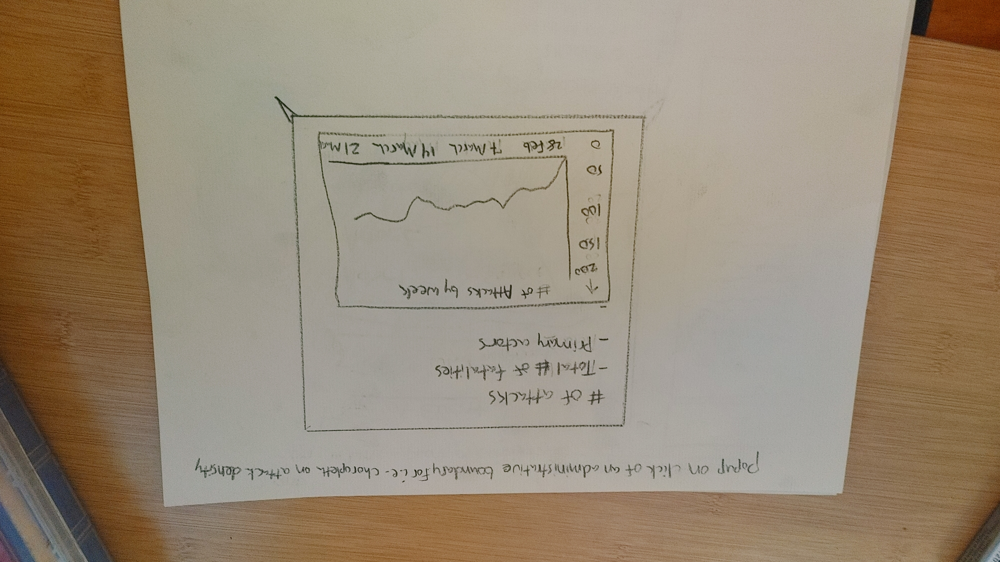

# Conflict-Crisis-Mapping-Project

## 
 <b>Table of Contents </b>

<b>1.</b> Introduction 

<b>2.</b> Methodology 

<b>3.</b> Data Processing & Analysis 

<b>4.</b> Dissemination of Visualizations

<b>5.</b> Evaluation of Effects 

<b>6.</b> Conclusion

<b>7.</b> Citations

# 
 <b>Chapter 1: Introduction 
</b>

This repository hosts the Ukrainian War Information Mapping Project. It is designed to collect and process data from the Armed Conflict Location and Event Data Project's RESTful API in order to document confrontations currently taking place in Ukraine. This project aims to contextualize and inform the public of events happening in real-time as they're occurring in eastern Europe. Other datasets that will be utilized include The United Nations Population Fund's [Ukrainian Subnational Population Statistics from 2020](https://data.humdata.org/dataset/cod-ps-ukr) as well as The  United Nations Office for the Coordination of Humanitarian Affairs' [border crossing locations.](https://data.humdata.org/dataset/ukraine-border-crossings) Another excellent source that will be utilized comes from Meta's [High Resolution Population Density Maps](https://data.humdata.org/dataset/ukraine-high-resolution-population-density-maps-demographic-estimates.).

Additionally, the project aims to utilize a broad portfolio of Web 2.0 tools and frameworks for cartography including a wide variety of data design, visualization, and UI-centered platforms. These tools and frameworks provide effective means for data aggregation, visualization, and public dissemination. Data from the ACLED's RESTful servers will provide updated content throughout a map including a user interface with charts in popups related to the weekly ACLED report. This will be integral towards providing an up-to-date account of what is happening in real time while also displaying contextualization through user input and data visualizations. 

Roth

 This project seeks to fill a corner in the cartography cube by <a href= "https://www.researchgate.net/publication/271078641_Interactive_Maps_What_we_know_and_what_we_need_to_know"> Roth from MacEachren (1994)</a> by being a fairly interactive, public-facing map that synthesizes and presents <i>knowns</i> as opposed to revealing more <i>unknowns.</i> In other words, the UI will not provide an <i>extreme</i> level of interactivity because it is not concerned with the task of revealing <i>unknowns,</i> but rather, presenting what is <i>known.</i> Therefore, the project seeks to constrain user interactivity to a limited degree. This ensures synthesis of the known data can be openly peer-reviewed reproducible in a like-minded project.

<i>Figure 1 depicts a basemap of Ukraine with a user interface for discovering the dataset.</i>

<i>Figure 2. A choropleth map depicting oblasts in Ukraine and the density of attacks shaded from light to dark. </i>

<i>Figure 3. This wireframe depicts a popup of user's click on a Ukrainian oblast. The user will see data aggregated by attacks in the oblast for the week followed by relevant information.</i>

 <i> Figure 4. This wireframe depicts a popup of a user's click on an event point. The ACLED provides data about what type of event took place, when, a source, as well as actors and sub-actors.</i>

The users in mind for this project should be considered first and foremost. By utilizing front-end geoprocessing tools, mobile/desktop HTML frameworks such as Bootstrap, and an assortment of other useful tools and libraries, the project should help end users better understand the situation in real time. Additionally, the audience for this map will likely be those who are concerned for the ongoing events in Ukraine. Therefore, links to humanitarian relief organizations involved with ongoing events in eastern Europe will be included in an about section that users can easily click on and path to corresponding web donation portals. 

# Chapter 2: Methodology 

## Data 

Below is a list of primary resource datasets that will be utilized for this project:

1. United Nations Population Fund's <a href="https://data.humdata.org/dataset/cod-ps-ukr">Ukrainian Subnational Population Statistics</a>

2. Meta's <a href="https://data.humdata.org/dataset/ukraine-high-resolution-population-density-maps-demographic-estimates">High Resolution Population Density Maps + Demographic Estimates of Ukraine</a>

3. United Nation's Office for Coordination of Humanitarian Affairs in Ukraine (OFCHA) - <a href="https://data.humdata.org/dataset/ukraine-border-crossings">Border Crossings</a>

4. OFCHA's <a href="https://data.humdata.org/dataset/hrp-projects-ukr">Humanitarian Response Plan projects for Ukraine</a>

### Tools for Process 
##### Backend data analysis and processing is conducted in Python utilizing Geopandas in a Jupyter environment. The frontend web interface will be made with HTML/CSS and Javascript in a Node.js environment. Data visualizations such as charts and graphs will be made with D3 and Chart.js. JS libaries include D3, Leaflet, and Turf.js for frontend geoprocessing. Additional GIS tools include QGIS, geojson.io, Mapshaper, and CLI tools such as OGR/GDAL. One other library that might prove useful is simple-statistics.js for data aggregation. 

 ##### The project's ACLED component includes a direct call to their RESTful API to be updated each Monday of the week. Additional flat files that could be utilized include GeoJSON / TopoJSON formats as well as CSV.

## Medium for Delivery 

The map UI is a browser-based application accessible across mobile and desktop devices utilizing the libraries listed above.

# Citations

1. [The Armed Conflict Location and Event Data Project](https://acleddata.com/acled-religion) is extremely useful for conflict data hosted by this non-profit organization. They have a relatively new portal for religious violence data that could be a useful test case for this project. 

2. [The Human Data Exchange](https://data.humdata.org/) provides a whole host of useful humanitarian data sets. They have a wide array of different development and resource datasets that can be useful for information mining. 

3. [Ushahidi](https://www.ushahidi.com/) is a company that gained popularity for its crowdsourcing capabilities during the Kenyan election violence of 2008. They also hosted crisis mapping campaigns for Haiti's earthquake and a transparency watch for Macedonian corruption. They've grown as a company and may prove to be useful in my thesis research. 

4. The [ACLED Early Warning Research Hub ](https://acleddata.com/early-warning-research-hub/#tools) is a useful website off of the ACLED main page. This could provide useful data for visualizing up-to-the-date information in the UI. 
   
5. The [ACLED RESTful API User Guide](chrome-extension://efaidnbmnnnibpcajpcglclefindmkaj/viewer.html?pdfurl=https%3A%2F%2Fwww.acleddata.com%2Fwp-content%2Fuploads%2Fdlm_uploads%2F2017%2F10%2FAPI-User-Guide.pdf&clen=361440&chunk=true)
